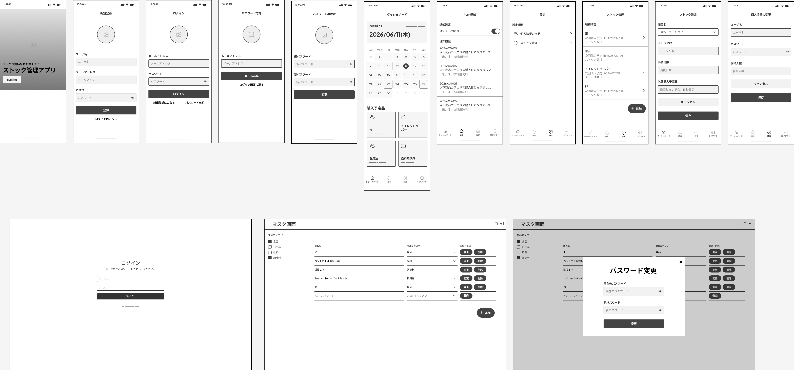

# ストック管理システム

保存のきく食品や日用品のストックを管理し、買い忘れを防ぐWebアプリケーションである。

商品ごとに消費日数とストック数を登録すると、次回購入予定日を自動で割り出す。
予定日が近づくとPush通知で知らせる。



## 解決したい課題

夫婦や同居人がいる世帯では、ストックの残量を互いに把握できず、同じ日用品を別々に買ってしまうことがある。
逆に、まだ残っているものを週末のまとめ買いでもう一度買うこともある。

在庫と次に買う日を1か所に置き、当日の朝に通知することでこれを防ぐ。

## 主な機能

### 一般ユーザー

- **ストック管理**：商品ごとに消費日数とストック数を登録する。消費日数の初期値は世帯人数から決まる
- **ダッシュボード**：カレンダーに購入予定日を出し、1週間以内に予定日が来るものを一覧にする。購入ボタンで次回購入予定日を進める
- **Push通知**：毎朝9時に、当日が購入予定日のものを知らせる。予定日を過ぎたものにも送り続ける
- **通知履歴**：未読の通知を一覧にする。既読にすると画面から消える
- **アカウント**：登録、ログイン、世帯人数を含む個人情報の変更、仮パスワードによるパスワード再設定

### 管理者

- 商品マスタとカテゴリのCRUD
- 使用中の商品とカテゴリは削除できない
- 管理者パスワードの変更

### PWA

一般ユーザーの画面（`/app/*`）はホーム画面に追加して単独のウィンドウで開ける。
オフラインではオフライン用の画面を出す。
管理画面はService Workerのスコープ外に置いている。

## 技術構成

| 層 | 採用 |
|---|---|
| サーバ | PHP 8.4、Laravel 13 |
| 画面 | React 19、TypeScript、Inertia 3、Tailwind CSS 4 |
| DB | PostgreSQL 18 |
| 認証 | Laravel Fortify のセッション認証（一般ユーザーと管理者で別のガード） |
| Push通知 | Web Push（`laravel-notification-channels/webpush`） |
| 開発環境 | Laravel Sail（Docker） |

REST APIは持たず、画面とサーバはInertiaでつなぐ。

## ドキュメント

| 文書 | 中身 |
|---|---|
| [AGENTS.md](AGENTS.md) | 要件定義書。何を作るか、および開発ルール |
| [doc/design/](doc/design/README.md) | 基本設計書。どう作られているか |
| [doc/plans/](doc/plans/) | 計画書。設計を決めた理由と、採らなかった案 |

基本設計書は次の8つに分かれている。

- [全体構成](doc/design/README.md)
- [画面とルート](doc/design/screens.md)
- [データ設計](doc/design/data-model.md)
- [認証とアカウント](doc/design/auth.md)
- [ストック管理とダッシュボード](doc/design/stock.md)
- [Push通知](doc/design/notification.md)
- [管理者向けのマスタ管理](doc/design/admin.md)
- [非機能の実現方法](doc/design/non-functional.md)

DB設計の図の正本は drawSQL 側にある（非公開のワークスペースのため外部からは開けない）。
エクスポートした [`doc/specifications/drawSQL-pgsql-export-2026-08-28.sql`](doc/specifications/drawSQL-pgsql-export-2026-08-28.sql) がリポジトリ内の写しである。

## 動かし方

Docker が要る。
Laravel Sail で動かすため、ホストに PHP と Node は要らない。

```bash
git clone https://github.com/YUTOKONISHI/w24-output.git
cd w24-output
cp .env.example .env

# Sail 本体を入れる
docker run --rm -v "$(pwd)":/opt -w /opt laravelsail/php84-composer:latest \
    composer install --ignore-platform-reqs

./vendor/bin/sail up -d
./vendor/bin/sail artisan key:generate
./vendor/bin/sail artisan migrate --seed
./vendor/bin/sail npm install
./vendor/bin/sail npm run build
```

http://localhost で開く。

Push通知を試すときは、VAPIDの鍵を作って `.env` に書く。

```bash
./vendor/bin/sail artisan webpush:vapid
```

送信したメールは Mailpit（http://localhost:8025）で読む。
パスワード再設定の仮パスワードもここに届く。

`docker compose` は Web、キューのワーカー、スケジューラ、PostgreSQL、Mailpit を立ち上げる。
Push通知はキューを経て送られるため、ワーカーが止まっていると届かない。

### 開発用のアカウント

`migrate --seed` で入る。ローカル専用である。

| 種別 | ID | パスワード |
|---|---|---|
| 一般ユーザー（世帯人数あり） | `test@example.com` | `password` |
| 一般ユーザー（世帯人数なし） | `no-household@example.com` | `password` |
| 管理者 | `admin` | `password` |

管理画面は http://localhost/admin/login から入る。

### 開発中の起動

```bash
./vendor/bin/sail composer dev
```

Vite の開発サーバとログの追尾がまとめて立ち上がる。

## 検証

```bash
./vendor/bin/sail composer ci:check
```

ESLint、Prettier、`tsc --noEmit`、Pint、PHPStan（level 7）、`artisan test` を順に実行する。
